# Sistema_Solar

Solar System Simulation made in JavaScript, HTML, and CSS.

Follow the steps below to set up and run the project on your local machine:

1. **Instale o Node.js**

   If you don't have Node.js installed on your machine, install the latest version of Node.js from the official website: [https://nodejs.org/en](https://nodejs.org/en)

   To verify if Node.js is installed correctly, execute the following commands in your terminal:
    ```shell
    node -v
    ```

2. **Clone the Repository**

   Use Git to clone this repository to your local machine.
   ```shell
   git clone https://github.com/Wendel09Manfrs/Sistema_Solar.git

3. **Abra o projeto pelo Visual Studio Code**

4. **Install Dependencies**

   In the code editor or your terminal of choice, navigate to the project folder and install the necessary dependencies, which include the three.js and parcel.js packages:
    ```shell
    npm install three
   ```
    ```shell
    npm install parcel
   ```

5. **Run the Project**

    After installing all necessary packages, you can start the project by running the following command:
     ```shell
     npx parcel index.html
     ```

   To view the generated scene, simply access the link in your browser: http://localhost:1234.


## Photo Gallery

Here are some photos from the application:

<div style="display: grid; grid-template-columns: repeat(auto-fill, minmax(200px, 1fr)); gap: 10px;">
    <div><a href="photos/mercury.jpg" target="_blank">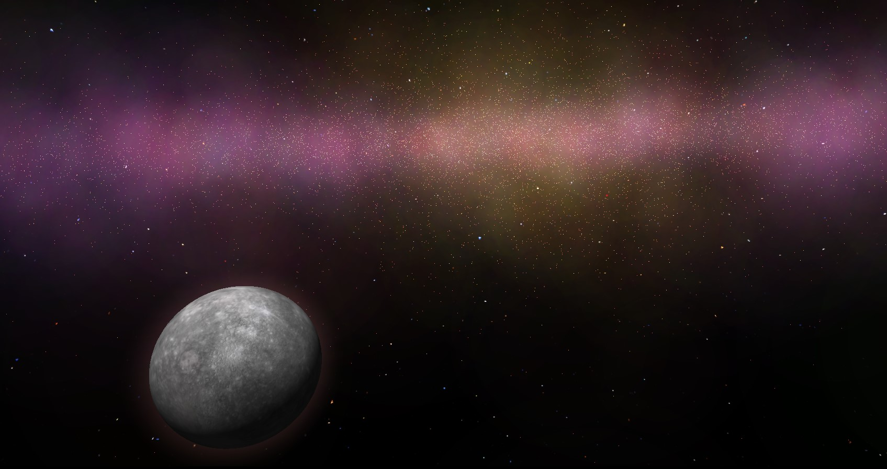</a></div>
    <div><a href="photos/neptune.jpg" target="_blank">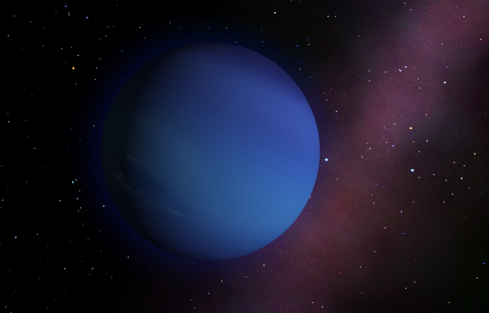</a></div>
    <div><a href="photos/jupiter.jpg" target="_blank">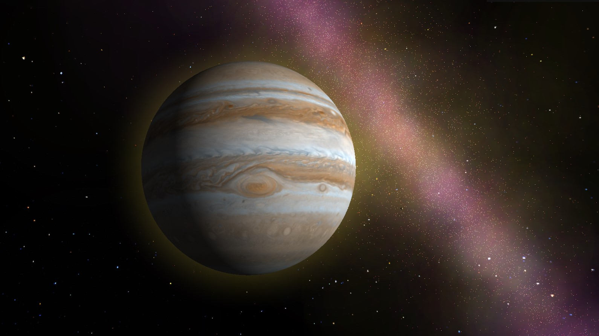</a></div>
    <div><a href="photos/iO.jpg" target="_blank">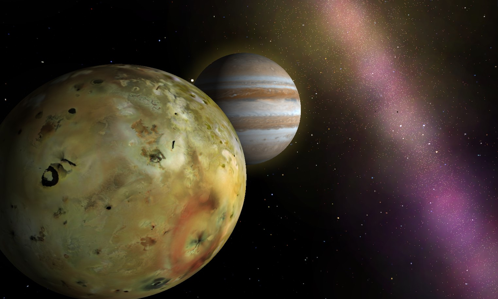</a></div>
    <div><a href="photos/saturn.jpg" target="_blank">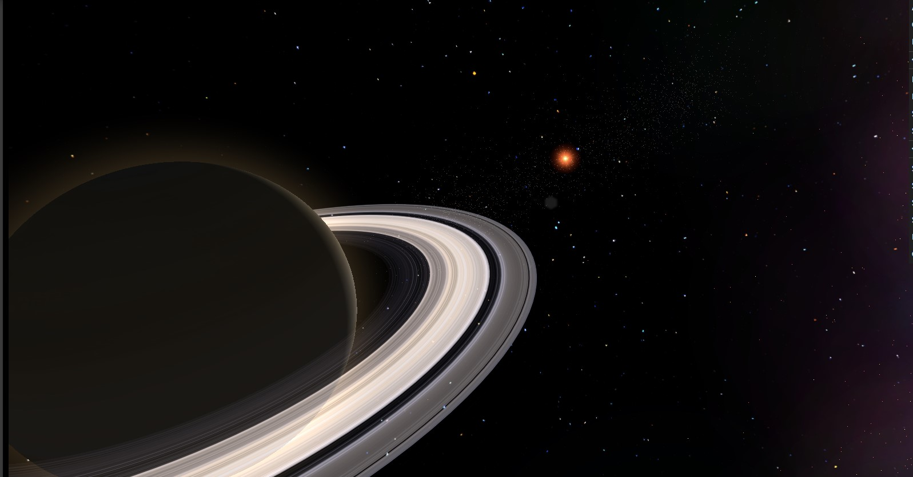</a></div>
    <div><a href="photos/sun.jpg" target="_blank">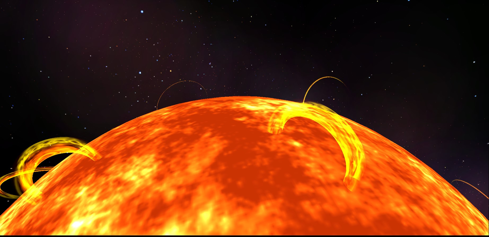</a></div>
    <div><a href="photos/Holes.jpg" target="_blank">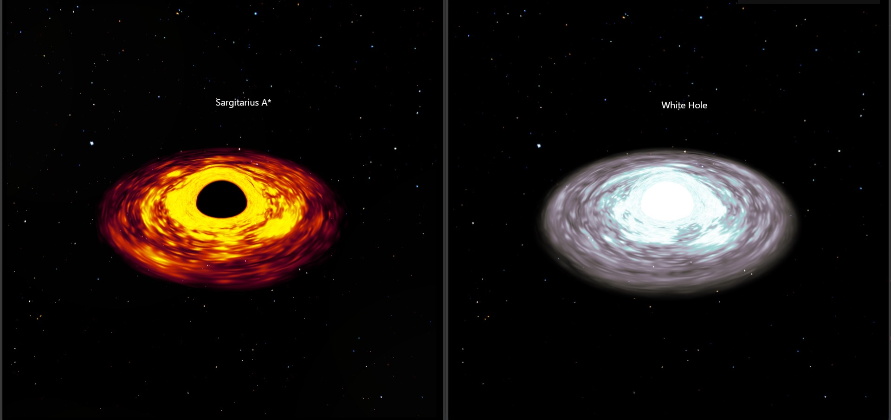</a></div>
    <div><a href="photos/WhiteHole.jpg" target="_blank">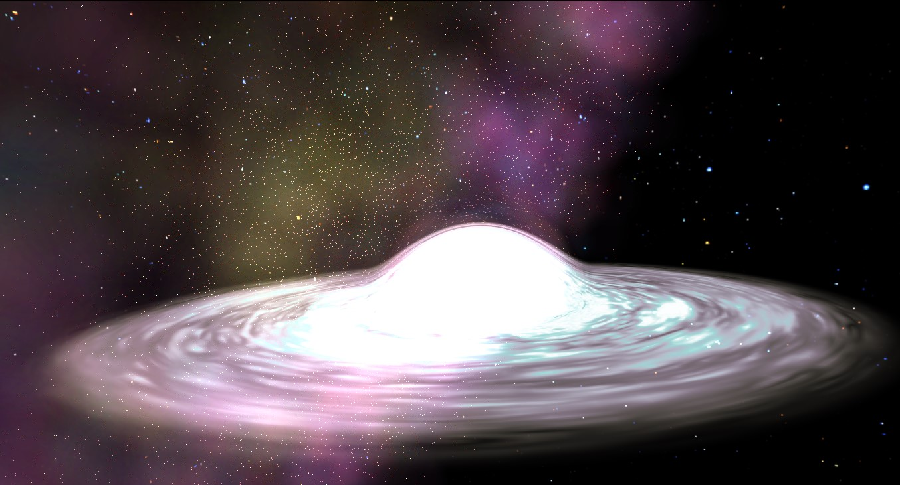</a></div>
    <div><a href="photos/SargitariusA.jpg" target="_blank">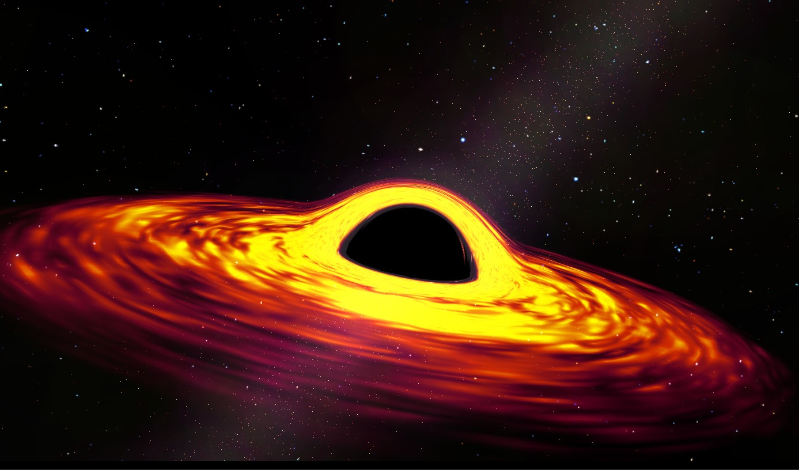</a></div>
       <div><a href="photos/urano.jpg" target="_blank">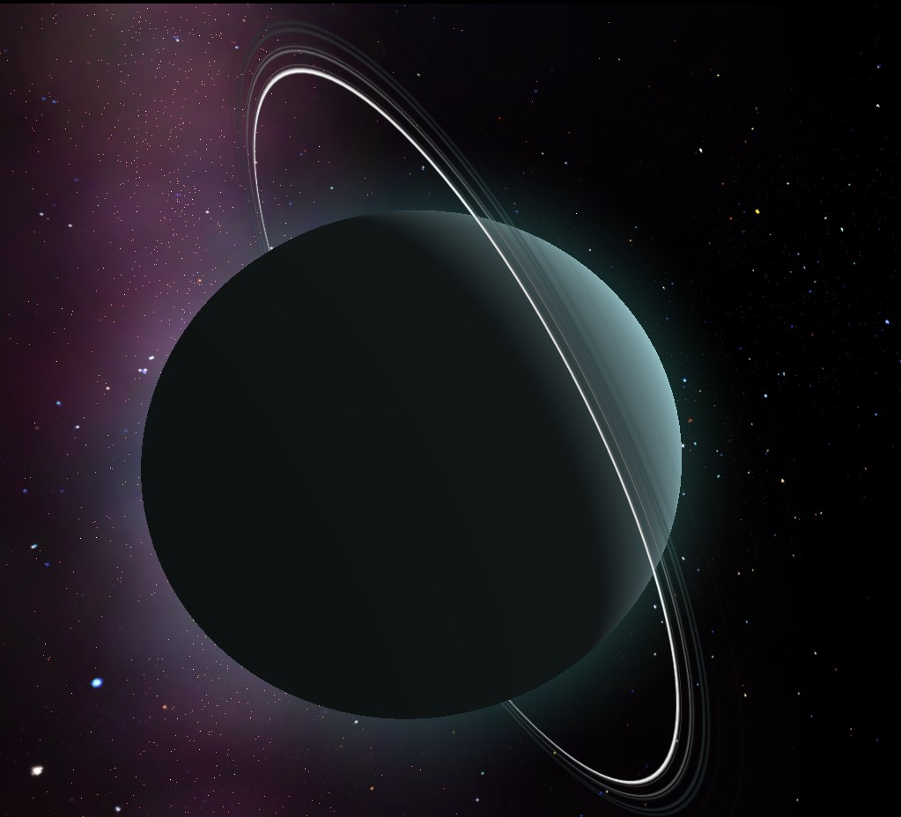</a></div>
    <div><a href="photos/cloudOort.jpg" target="_blank">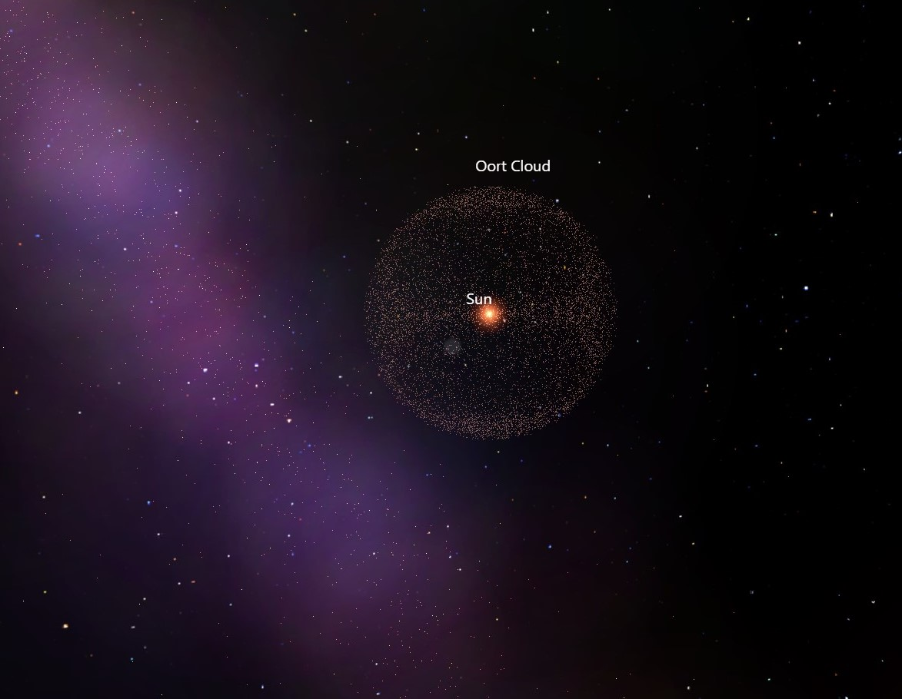</a></div>
    <div><a href="photos/galaxy.jpg" target="_blank">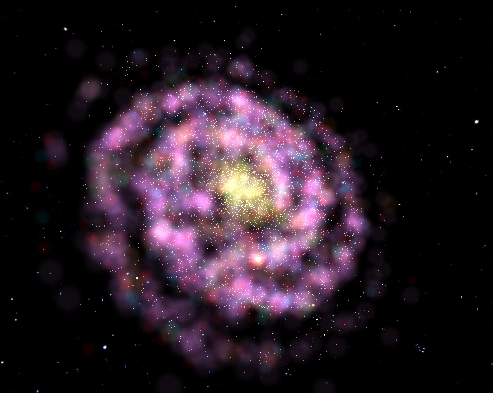</a></div>

</div>


